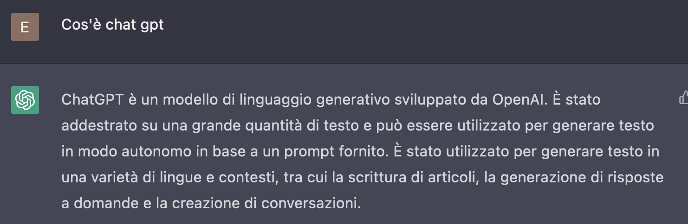
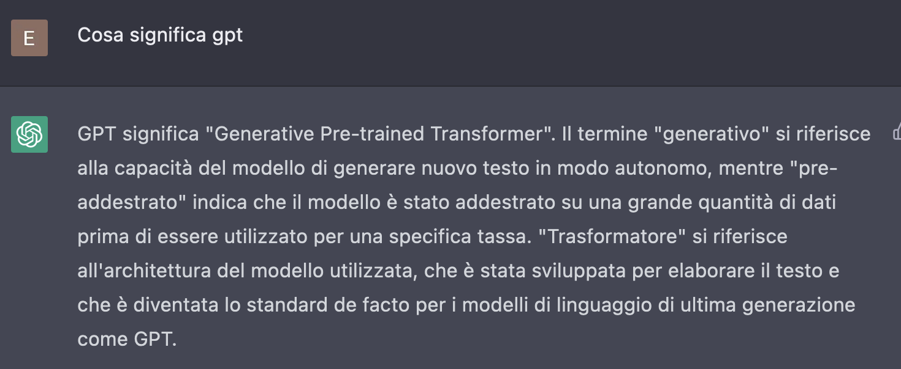
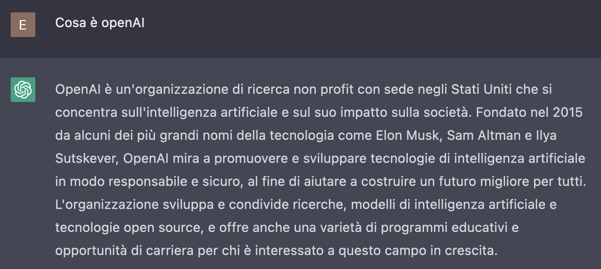
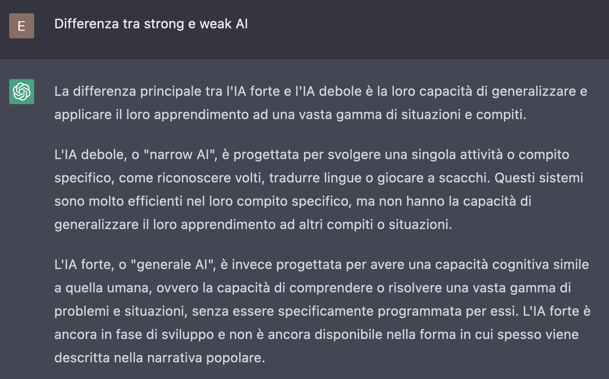
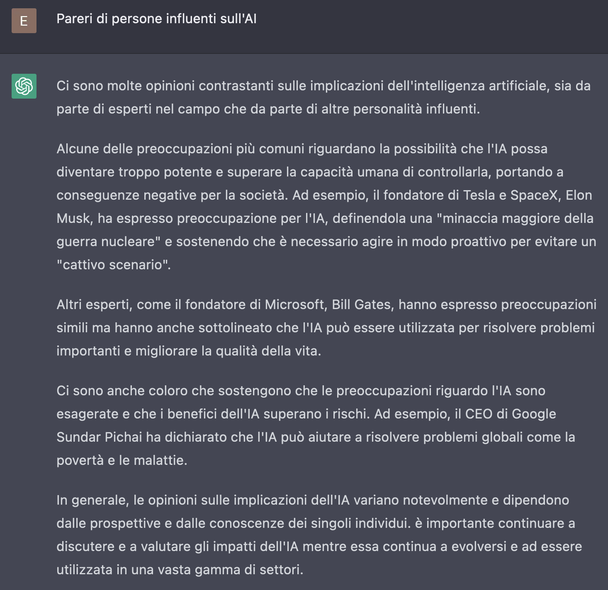
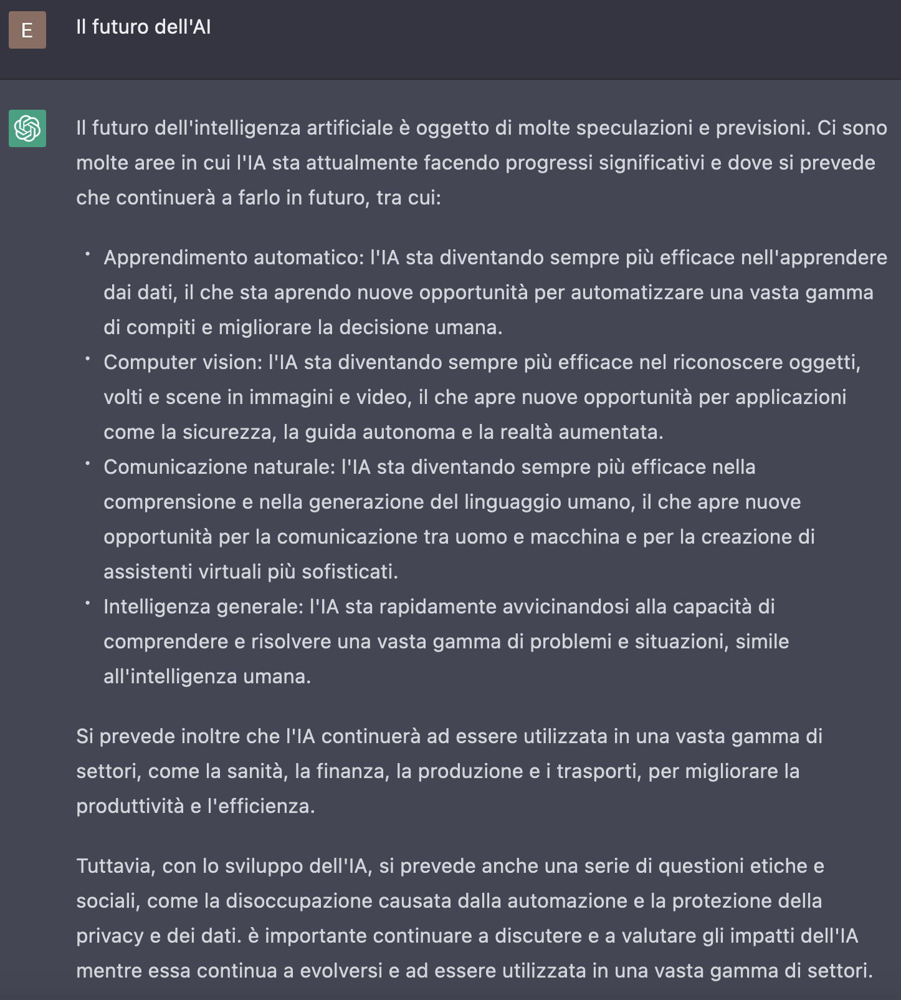

# Preparazione corso sull'AI

Esempio di domande fatte a ChatGPT per la preparazione del talk

## Cos'è ChatGPT

## Cosa significa GPT

## Cosa è openAI

## Differenza tra strong e weak AI

## Pareri di persone influenti sull'AI

## Il futuro dell'AI

